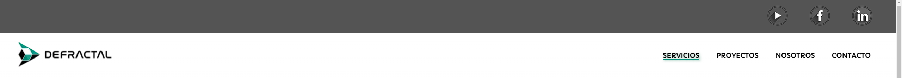

# Defractal

Defractal es una página web que ofrece servicios de programación de apps a medida, diseño web y desarrollo web, marketing digital, creación de contenido y consultoría en tecnología de la información y la comunicación.

## Descripción del proyecto

La página web está estructurada en las siguientes secciones:

### Componentes Principales:

#### Header

El header de la página web contiene un banner con un componente "rrssbar" con los logos y enlaces a sus redes sociales,el logo de la empresa y un menú de navegación con los siguientes enlaces:

* Servicios
* Proyectos
* Nosotros
* Contacto

#### footer

El footer de la página web contiene el isotipo de la empresa, el menu de navegación más la privacidad, aviso legal y cookies (Sin enlaces estos tres últimos), información de contacto de la empresa y el diseñador de la web.

El footer de la página web contiene información de contacto de la empresa, como su dirección, teléfono y correo electrónico.

### Páginas:

#### Index

La sección main de la página web contiene las siguientes secciones:

* Hero: Un banner con un título y subtitulo sobre una imagen con paralaje, más un botón que llama a la acción.
* Separador: con el isotipo y nombre de la empresa más un slogan.
* Servicios: Un componente que muestra los servicios que ofrece la empresa, con un título, una imagen iconográfica y un slogan.
* Kit Digital: apartado con información extra para destacar la prestación del servicio subvencionado del Kit Digital.
* Proyectos: Una sección formada por componentes de tipo card que muestran los proyectos que ha realizado la empresa con una imagen, tipo, título y descripción corta.
* Separador: Un banner con un título y subtitulo sobre una imagen con paralaje.

#### Servicios

En esta sección se muestran los servicios que ofrece la empresa.
consta de:

* Hero: Imagen principal
* Servicios1: Titulo, resumen de los servicios y boton call to action.
* Servicios2: Un componente que muestra los servicios que ofrece la empresa, con un título, una imagen iconográfica y un slogan.

#### Proyectos

En esta sección se muestran los proyectos que ha realizado la empresa, como sitios web, aplicaciones móviles y campañas publicitarias.

Está formada por:

* Hero: Imagen con paralaje más un texto directo hacia el potencial cliente.
* Proyectos: Una sección formada por componentes de tipo card que muestran los proyectos que ha realizado la empresa con una imagen, tipo, título y descripción corta.
* Kit Digital: apartado con información extra para destacar la prestación del servicio subvencionado del Kit Digital.

#### Nosotros

En esta sección se muestra información sobre la empresa, como su misión, visión y valores.

Se conforma de:

* Hero: Un banner con un título y subtitulo sobre una imagen con paralaje, más un botón que llama a la acción.
* Sobre Nosotros: Texto descriptivo amplia sobre la empresa y el equipo humano que la compone.
* Foto del equipo Defractal.

#### Contacto

En esta sección se muestra un formulario de contacto para que los usuarios puedan enviar un mensaje a la empresa y un frame de google maps con la ubicación de las oficinas.

#### 404

Página personalizada de "Página no encontrada" donde redirigimos al usuario a un video de Youtube de la empresa con la intención de mantenerlo en nuestro canal para que conozca más sobre nosotros y nuestro trabajo.

### Animaciones y Responsive

La web contiene varias animaciones en los menús y en diversos elementos, la mayoría relacionados con la escala de las imágenes e iconos.

En este gif mostramos el comportamiento a tamaño completo a resolución full HD (1920x1080):

 
 
 
 
 
 
 
 

Casi todos los elementos son Flex y Grid, simplificando y optimizando enormemente el comportamiento de la web ante dispositivos antiguos o con resoluciones mínimas. 

Comienza a actuar de forma errónea a partir de los 280 píxeles de ancho, por lo que prácticamente todos los dispositivos veran correctamente la web con sus elementos centrados y ordenados. 

## Tecnologías utilizadas

La página web está desarrollada utilizando las siguientes tecnologías:

* HTML
* CSS
* JavaScript
* Astro

## Autoría

La página web ha sido integramente diseñada por [Kilian Vázquez Rodríguez](mailto:killthedigital@gmail.com)

## Colores y tipografías

### Colores utilizados

La paleta de colores utilizados en la página web es bastante sencilla, 3 tonos de verdes con diferente tono/luminosidad, blanco, negro y dos grises:

* MainGreen: rgba(20, 156, 138, 1);
* DarkGreen: rgba(0, 106, 92, 1);
* LightGreen: #419274;
* Grey: hsl(0, 0%, 33%);
* LightGrey: hsl(0, 0%, 67%);

### Tipografías utilizadas

Ya que no siempre es fácil encajar dos tipos de tipografías, lo simplificamos a una única, haciéndola identificativa de la empresa, Cabriola.

## Despliegue

La página web está desplegada en [GitHub Pages](https://github.com/tu-usuario/tu-repo).

## Fuentes/Recursos utilizados

Las fuentes y recursos utilizados en la página web son:

* [Google Fonts](https://fonts.google.com/)
* [Youtube](https://www.youtube.com/) (Menú hamburguesa y animación menú horizontal)

Todos los elementos tomados de otros programadores en fuentes como Youtube, han sido asimilados, testeados y adaptados al proyecto, ya que estos se presentaban como elementos simples fuera de un contexto como una web.
